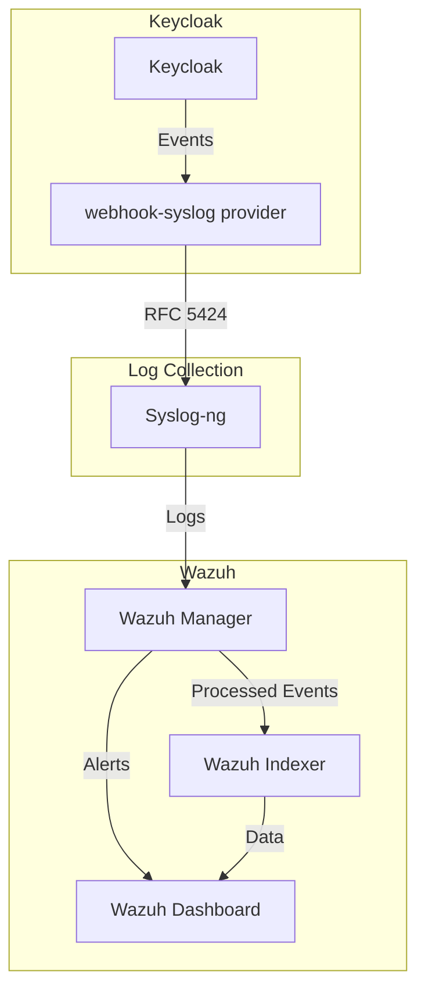

# Keycloak-Wazuh Integration

A comprehensive solution for monitoring Keycloak authentication events using Wazuh SIEM.

## Overview

This project demonstrates how to integrate Keycloak with Wazuh to monitor authentication events, detect security
threats, and maintain compliance. It provides a complete setup with custom decoders and rules specifically designed for
Keycloak events.

## Architecture

<!-- Improved with descriptive alt text, embedded diagram, and proper reference -->
<div align="center">
  <figure>
    <figcaption><strong>Keycloak-Wazuh Integration Architecture</strong></figcaption>



    Data flow diagram showing how events move through the system components

  </figure>
</div>

The integration works by:

1. Configuring Keycloak to send events to Syslog using a webhook provider
2. Collecting these logs with Syslog-ng
3. Processing them in Wazuh using custom decoders and rules
4. Storing and indexing the events in Wazuh Indexer
5. Visualizing the data in Wazuh Dashboard

[Read more about the architecture](docs/architecture/README.md)

## Features

- Real-time monitoring of Keycloak authentication events
- Detection of security threats (brute force attacks, suspicious logins, etc.)
- Tracking of administrative changes
- Compliance monitoring
- Customizable alerting

## Quick Start

```bash
# Clone the repository
git clone https://github.com/stephane-segning/keycloak-wazuh-siem.git
cd keycloak-wazuh-siem

# Start the environment
docker compose up -d
```

For detailed setup instructions, see the [Deployment Guide](docs/guides/deployment.md).

## Documentation

- [Architecture Overview](docs/architecture/README.md)
- [Deployment Guide](docs/guides/deployment.md)
- [Keycloak Configuration](docs/guides/keycloak-configuration.md)
- [Wazuh Rules and Decoders](docs/guides/wazuh-configuration.md)
- [Use Cases and Examples](docs/examples/README.md)

## Components

### Keycloak

[Keycloak](https://www.keycloak.org/) is an open-source Identity and Access Management solution that provides single
sign-on, identity brokering, and social login.

### Wazuh

[Wazuh](https://wazuh.com/) is an open-source security monitoring solution that provides threat detection, integrity
monitoring, and compliance.

### Syslog-ng

[Syslog-ng](https://www.syslog-ng.com/) is a log management solution that collects, processes, and forwards log
messages. This is a bonus, because the Keycloak Webhook can send webhook directly to Wazuh. So we use 
this component just for more control over the log collection.

## License

This project is licensed under the MIT License - see the [LICENSE](LICENSE) file for details.
