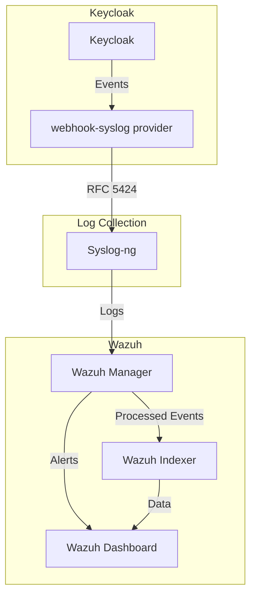

# Architecture Overview

This document describes the architecture of the Keycloak-Wazuh integration and explains how data flows through the system.

## Components

### Keycloak

[Keycloak](https://www.keycloak.org/) is an open-source Identity and Access Management solution that provides single sign-on, identity brokering, and social login.

In this integration, Keycloak is configured to:
- Send authentication events to Syslog using the webhook-syslog provider
- Track both user events (logins, password changes, etc.) and admin events (realm changes, client registrations, etc.)

### Syslog-ng

[Syslog-ng](https://www.syslog-ng.com/) is a log management solution that collects, processes, and forwards log messages.

In this integration, Syslog-ng:
- Receives log messages from Keycloak
- Formats them according to RFC 5424
- Forwards them to the Wazuh manager

### Wazuh Manager

[Wazuh](https://wazuh.com/) is an open-source security monitoring solution that provides threat detection, integrity monitoring, and compliance.

In this integration, the Wazuh Manager:
- Receives log messages from Syslog-ng
- Processes them using custom decoders and rules
- Generates alerts based on the rules
- Forwards the processed events to the Wazuh Indexer

### Wazuh Indexer

The Wazuh Indexer (based on OpenSearch) stores and indexes the events for later retrieval and analysis.

### Wazuh Dashboard

The Wazuh Dashboard provides a web interface for visualizing and analyzing the events.

## Data Flow

## Event Processing

1. **Event Generation**: Keycloak generates events for various activities:
   - Authentication events (login, logout, failed login)
   - Account management (password change, profile update)
   - Administrative actions (realm changes, client registration)

2. **Event Forwarding**: The webhook-syslog provider formats these events as JSON and sends them to Syslog-ng.

3. **Log Collection**: Syslog-ng receives the events and forwards them to the Wazuh Manager.

4. **Decoding**: The Wazuh Manager uses a custom decoder (`keycloak_json`) to parse the JSON events.

5. **Rule Matching**: The parsed events are matched against custom rules to detect:
   - Brute force attacks
   - Suspicious login attempts
   - Administrative changes
   - Policy violations

6. **Alerting**: When a rule matches, Wazuh generates an alert.

7. **Indexing**: All events and alerts are indexed in the Wazuh Indexer.

8. **Visualization**: The events and alerts can be visualized and analyzed in the Wazuh Dashboard.

## Security Considerations

- **Authentication**: All components use secure authentication methods.
- **Encryption**: Communication between components is encrypted using TLS.
- **Access Control**: Access to the Wazuh Dashboard is restricted to authorized users.

## Scalability

This architecture can be scaled by:
- Adding more Wazuh Managers in a cluster configuration
- Increasing the resources allocated to the Wazuh Indexer
- Distributing the Syslog-ng instances

## Monitoring and Maintenance

- Regular backups of the Wazuh Indexer data
- Monitoring of the Wazuh Manager and Indexer performance
- Updates to the rules and decoders as new threats emerge